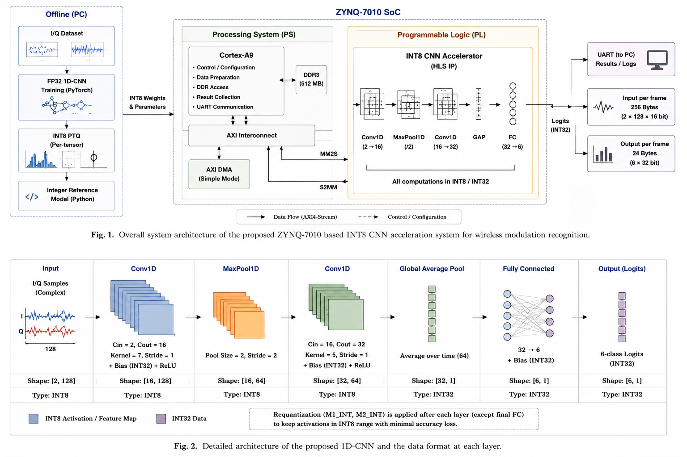
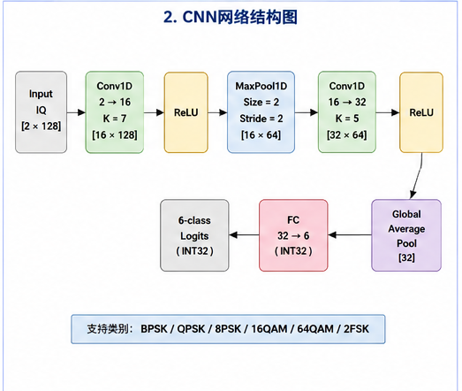
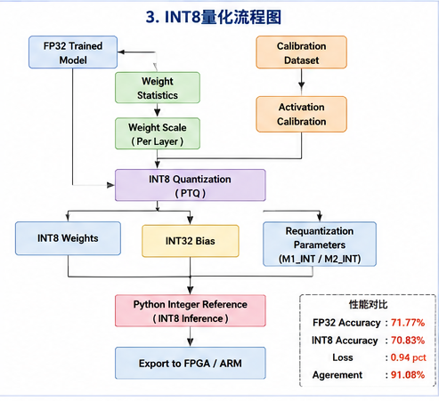
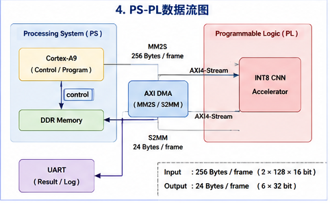
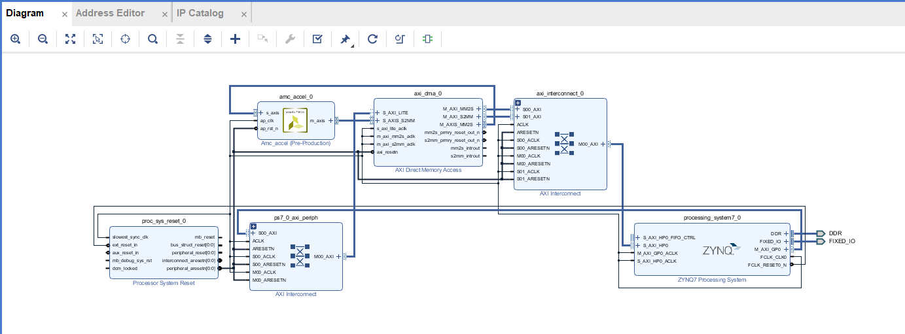
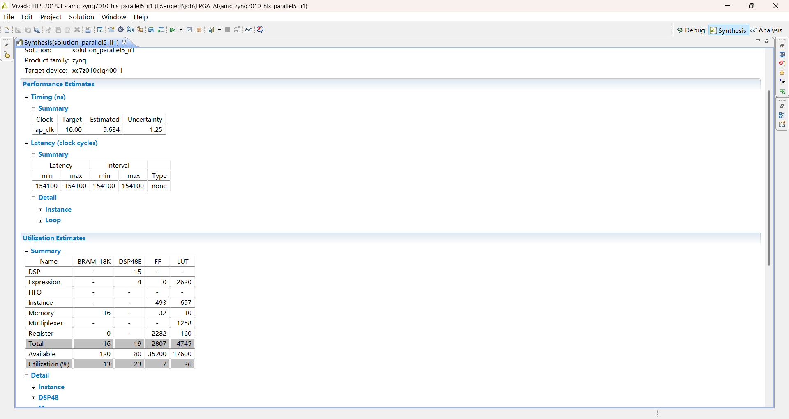
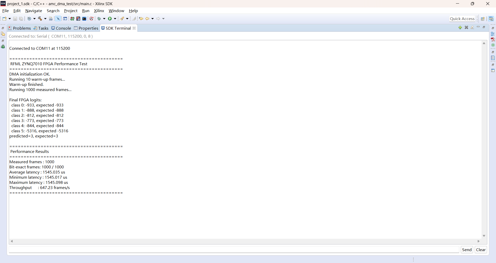
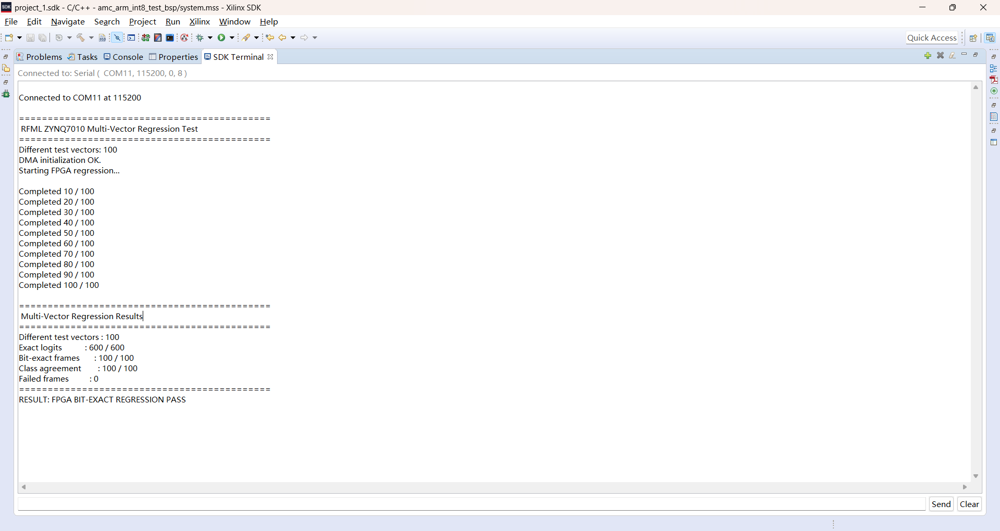

# ZYNQ-7010 INT8 RF Modulation Classification Accelerator

基于 ZYNQ-7010 的 INT8 量化 1D-CNN 无线信号调制识别加速器。

本项目完成了从 PyTorch 模型训练、INT8 PTQ、整数参考模型、
Vivado HLS 加速器设计，到 AXI DMA / PS-PL 系统集成及 FPGA 实板验证的完整流程。

最终优化 FPGA 相比 Cortex-A9 bare-metal INT8 软件实现获得约 **8.75× 推理加速**。

## Highlights

- 6 类无线信号调制识别：
  BPSK / QPSK / 8PSK / 16QAM / 64QAM / 2FSK
- FP32 Accuracy：**71.77%**
- INT8 Accuracy：**70.83%**
- INT8 精度损失仅 **0.94 pct**
- HLS latency：**229870 → 154100 cycles**
- FPGA 实测延迟：**2.303 ms → 1.545 ms**
- FPGA 实测吞吐：**434.24 → 647.23 fps**
- Optimized FPGA vs Cortex-A9：**8.75× speedup**
- 100 个不同测试样本：
  **600 / 600 logits bit-exact**

## System Architecture

## CNN Architecture

网络结构：

Input IQ `[2 × 128]`

→ Conv1D `2→16, K=7`

→ ReLU

→ MaxPool1D

→ Conv1D `16→32, K=5`

→ ReLU

→ Global Average Pool

→ Fully Connected `32→6`

## INT8 Quantization

采用 Post-Training Quantization (PTQ)。

| Model | Accuracy |
|---|---:|
| FP32 | 71.77% |
| INT8 | 70.83% |
| Accuracy Loss | 0.94 pct |

## FPGA Architecture

系统采用：

Cortex-A9 PS  
→ DDR  
→ AXI DMA MM2S  
→ AXI4-Stream  
→ INT8 CNN Accelerator  
→ AXI4-Stream  
→ AXI DMA S2MM  
→ DDR / Cortex-A9

输入：

- 128 × 16-bit packed IQ
- 256 Bytes / frame

输出：

- 6 × INT32 logits
- 24 Bytes / frame

## Vivado Block Design

## HLS Optimization

Baseline 中 Conv2 是主要计算瓶颈。

通过多路 partial-sum 和双输入通道 pair 并行计算结构，
降低 Conv2 reduction latency。

| Metric | Baseline | Optimized |
|---|---:|---:|
| Conv2 Latency | 180224 | 104448 |
| Total Latency | 229870 | 154100 |
| Estimated Clock | 8.541 ns | 9.634 ns |
| BRAM18K | 9 | 16 |
| DSP48E | 7 | 19 |
| FF | 1260 | 2807 |
| LUT | 2284 | 4745 |

Total latency reduction: **32.96%**

## FPGA Hardware Performance

测试条件：

- PL Clock：100 MHz
- 10 warm-up frames
- 1000 measured frames
- AXI DMA Simple Mode

| Platform | Average Latency | Throughput |
|---|---:|---:|
| Cortex-A9 INT8 C | 13.524 ms | 73.94 fps |
| FPGA Baseline | 2.303 ms | 434.24 fps |
| FPGA Optimized | **1.545 ms** | **647.23 fps** |

Optimized FPGA achieves:

- **8.75× speedup** over Cortex-A9
- **32.91% lower latency** than FPGA baseline
- **49.05% higher throughput** than FPGA baseline

## Bit-Exact Verification

完整验证链：

Python INT8 Integer Reference

= Cortex-A9 INT8 C

= HLS C Simulation

= RTL Co-Simulation

= ZYNQ-7010 FPGA Hardware

100 个不同测试样本：

| Metric | Result |
|---|---:|
| Test vectors | 100 |
| Exact logits | 600 / 600 |
| Bit-exact frames | 100 / 100 |
| Class agreement | 100 / 100 |

## Project Structure

python/     PyTorch model, dataset and INT8 export
hls/        Vivado HLS accelerator source and testbench
vivado/     Vivado reconstruction Tcl
sdk/        FPGA DMA and Cortex-A9 software test programs
docs/       Architecture diagrams and experiment screenshots
results/    Experimental results

## Toolchain

- Python / PyTorch
- Vivado HLS 2018.3
- Vivado 2018.3
- Xilinx SDK 2018.3
- ZYNQ-7010
- AXI4-Stream
- AXI DMA
- Bare-metal Cortex-A9

## Reproduction

1. Generate INT8 parameters
      python -m rfml_zynq.export_int8 \
          --checkpoint <checkpoint> \
          --config <config> \
          --header <weights.h> \
          --test-vector <test_vector.h>
2. HLS

Top function:amc_accel
Target device:xc7z010clg400-1
Clock target:10ns
Run:C Simulation
    C Synthesis
    C/RTL Co-Simulation
    Export RTL

3. Vivado
Rebuild the PS + AXI DMA + HLS accelerator system using:vivado/design_1.tcl

4. SDK
Two bare-metal examples are provided:
sdk/fpga_dma_test/
sdk/arm_int8_test/

## Future Work
 - Conv1 / Conv2 deeper parallelization
 - Accumulator banking / tree reduction
 - Ping-pong buffering
 - DMA / compute overlap
 - QAT
 - Power and energy-per-frame evaluation

 ## License
 see License